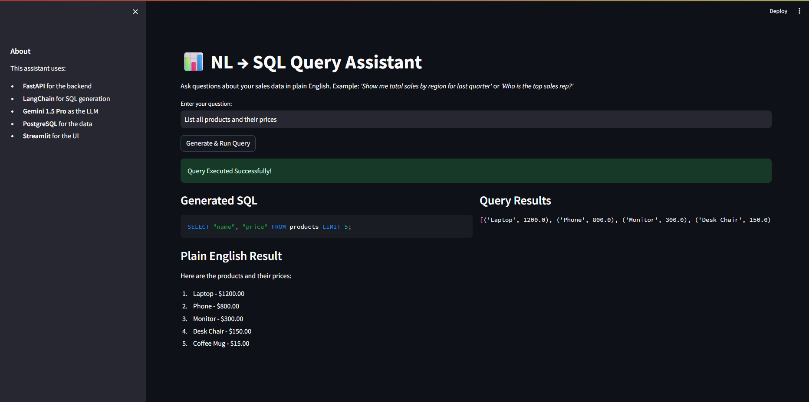
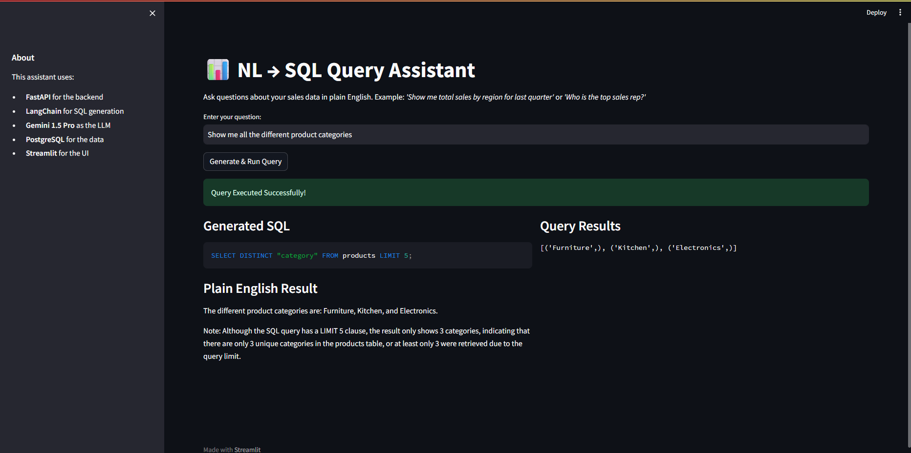
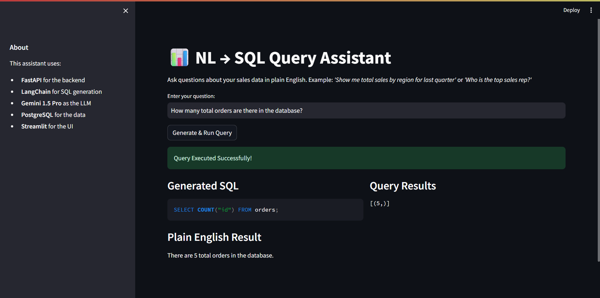
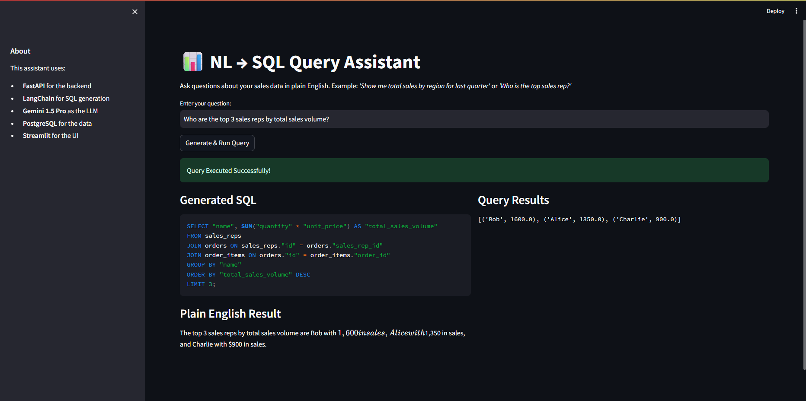
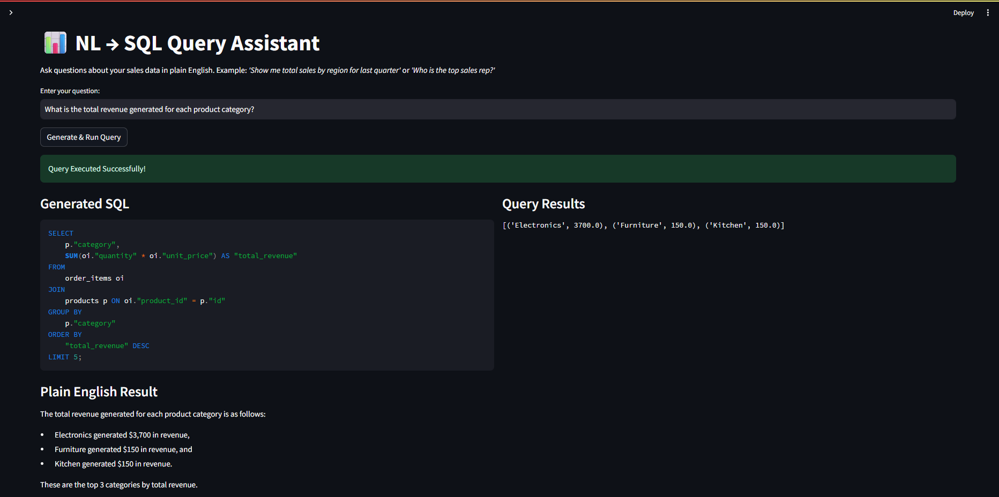
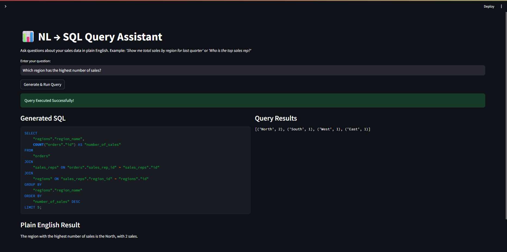
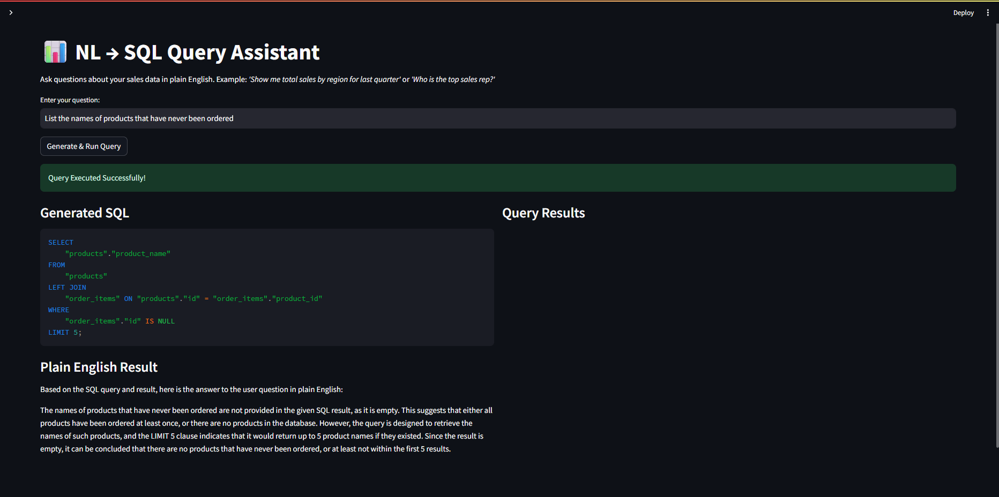

# 📊 NL → SQL Query Assistant

A powerful Natural Language to SQL assistant that allows users to query a PostgreSQL database using plain English. Built with FastAPI, LangChain, Streamlit, and Groq (Llama 3).

## 🚀 Features

- **Natural Language Querying**: Type questions like "What are the total sales by region?" and get SQL results.
- **Robust LLM Architecture**: Powered by Groq (Llama-3.3-70b) for lightning-fast queries, with automatic fallback to Google Gemini.
- **Plain English Explanations**: The assistant explains the SQL results back to you in clear, simple English.
- **E-commerce Data Schema**: Includes a structured dataset with regions, sales reps, products, and orders.
- **Full Stack Dockerization**: Easily deploy the entire system (Database, Backend, Frontend) with a single command.

## 🛠️ Tech Stack

- **Backend**: FastAPI (Python)
- **AI/LLM**: LangChain + Groq (Llama 3) & Google Gemini Fallback
- **Frontend**: Streamlit
- **Database**: PostgreSQL
- **Infrastructure**: Docker & Docker Compose

## 🏃 How to Run

### 1. Prerequisites
- Docker & Docker Compose installed on your machine.
- A Groq API Key and/or Google API Key.

### 2. Setup Environment Variables
Create a `.env` file in the root directory (or use the one already provided) with the following content:
```env
GROQ_API_KEY=your_groq_api_key_here
GOOGLE_API_KEY=your_google_api_key_here
```

### 3. Spin up the Containers
Run the following command to build and start the services. The database will automatically seed itself on startup!
```bash
docker-compose up --build
```

### 4. Access the App
- **Streamlit UI**: [http://localhost:8501](http://localhost:8501)
- **FastAPI Backend (Docs)**: [http://localhost:8000/docs](http://localhost:8000/docs)

## 📸 Screenshots

Here is the application in action, demonstrating natural language translations to complex SQL queries:









## 📂 Project Structure

- `/backend`: FastAPI service, SQLAlchemy models, and LangChain logic.
- `/frontend`: Streamlit application for the user interface.
- `/database`: Pre-defined PostgreSQL database schema.
- `docker-compose.yml`: Orchestrates the PostgreSQL, Backend, and Frontend services.

## 🧪 Example Queries
- "Show me total sales by region for last quarter"
- "Which region has the highest number of sales?"
- "List all electronic products and their prices"
- "How many orders were placed in the last 30 days?"